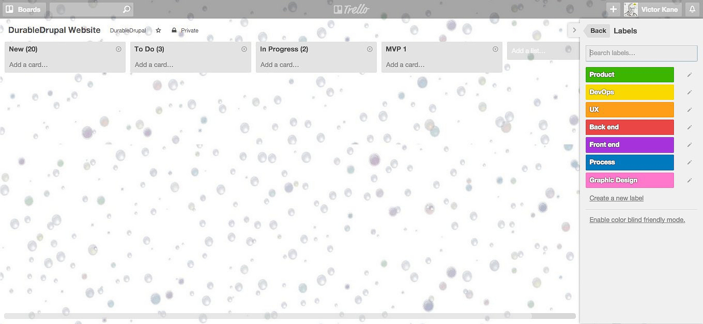
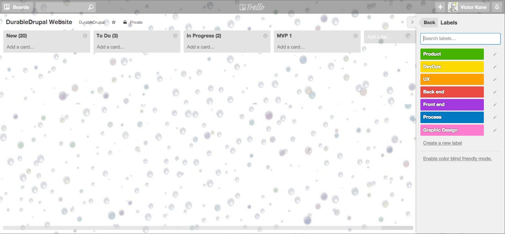

# Chapter 1. Project Inception {#chapter-01}

We are diving right into a real world project, the Durable Drupal Website, in order to demonstrate DurableDrupal Lean. 

So just where do we dive in? Where does inception live in any project?

## Project Inception

Project Inception lives in the Vision text to be presented at the Team Project Kickoff based upon a gathering of documentation, meeting and telephone conversation notes and other inputs for the preparation for that formal starting point for the project. The product owner (a client domain expert, marketing person, major stakeholder rep, etc.) will be providing much of these inputs and with the help of the initial core team, is responsible for writing the Vision text.

### Using the Vision text template

A template for the Vision text may be downloaded from the DurableDrupal site.

The Vision text helps to get the ball rolling at the Team Kickoff meeting because it puts forward a first stab at the project validation targets: Market, Problem and Product.

T> ### You don't have to use each section of the Vision text.
T>
T> The DurableDrupal Lean Vision text template simply provides convenient avenues of input, they are all optional. Don't feel forced to spend time filling out sections of this or any other doc!
T>
T> Most importantly, the Vision will represent a first processing of product inputs and provide a starting point at the Kickoff for beginning to understand and validate problem, product and market in terms of value. 

> "A market is the group of people you think might want to buy your product.... A problem is the reason that those people are going to use your product... A product is simply the way that you’re going to solve the user’s problem. It’s the end result of what you’re building. It’s the thing that people, presumably in the target market, are going to pay you money for." (from Laura Klein, *UX for Lean Startups*, Chapter 1)

The optional sections found in the Vision Text that you can fill out and use   (or add your own!) are as follows:

#### Validating the Market

> "You’ll know that you’ve successfully validated your market when you can accurately predict that a particular type of person will have a specific problem and that the problem will be severe enough that that person is interested in purchasing a solution."

Describe one or more types of people constituting the product market.

#### Validating the Problem

> "You are going to discover a problem that exists within your target market that you are capable of solving. Remember, if there’s no problem, then there is no compelling reason for people to purchase your product.... You’ll know that you’ve validated a problem when you start to hear particular groups of people complaining about something specific."

The best way of expressing the problem at this early stage is via a list of complaints, or pain points; or by filling out the Problem Summary found in the template.

#### Validating the Product

>  "Just because you have discovered a real problem and have a group of people willing to pay you to solve their problem, that doesn’t necessarily mean that your product is the right solution.... You’ll know that you’ve validated your product when a large percentage of your target market offers to pay you money to solve their problem." 

This is the heart of DurableDrupal Lean, in that we are aiming to deliver true value, not just software. The fact that an application runs as advertised does not mean it is finished. There must be a period of maintenance iterations used to adjust or even pivot the product until it demonstrably provides value. It is important to ensure this is understood right from the start.

#### Envisioning a product with a list of needs per pain point

For each pain point experienced by each person described as making up the product market, list the proposed solutions that would ease the pain.

#### Product Position Summary

An overall synthetic statement summarizing, at the highest level, the unique position the product intends to fill in the marketplace. Use the format provided or roll your own!

#### Candidate architectures

Members of the initial core team whose skillset includes software architecture, based on their past experience and the current vision, propose a core set of technologies, component models and deployment targets. It may require several iterations with the full team to finalize the choice.

#### Constraints

> “A constraint is a restriction on the degree of freedom you have in providing a solution. Constraints are effectively global requirements, such as limited development resources or a decision by senior management that restricts the way you develop a system. Constraints can be economic, political, technical, or environmental and pertain to your project resources, schedule, target environment, or to the system itself.” (From [Constraints: An Agile Introduction, on Agile Modeling](http://www.agilemodeling.com/artifacts/constraint.htm#sthash.RV6S97Od.dpuf)

### Vision text example

An example Vision text may be downloaded on the DurableDrupal site.

### Team Selection

Up till now the core team has consisted of the following team members:

* Anna (Product Owner)
* Jake (DevOps)
* Victor (Project Coach)

It must now be expanded, as part of the preparation for the Project Kickoff with the whole team. At that meeting the Vision text will cut to the core of the project and will be discussed and dissected as the basic raw material input for the project.

The team is expanded as follows:

* Anna (Product Owner)
* Jake (DevOps)
* Mark (UX)
* Jeff (Back-end)
* Lisa (Front-end)
* Victor (Project Coach)
* Sherrie (Graphic design)

The selection is made on the basis of our Vision. Now, rather than "10x" rockstars, we have a 10x team who get to be productive thanks to cross-collaboration, communication, focus and teamwork. If the so-called 10x developer does emerge (see [the article which started using that term](http://www.newyorker.com/magazine/2014/11/24/programmers-price) it is by dint of working as part of a great team. 10x is a social team thing or it is nothing. We tend to agree more with [this article](https://codequalified.com/blog/2014/11/20/nonsense-of-10x-developers-and-github-as-a-cv/).

T> #### "There is no such thing as a 10X developer (without a 10X environment)."

By front-end (everything that goes on in the client device, for example a tablet or browser) and back-end (everything connected to processes running on the server-side) we are referring to development specialists in each one of the layers involved in the [separation of concerns](http://en.wikipedia.org/wiki/Separation_of_concerns) we strive for in order not to mix business logic, data persistence and the user interface.

The Product Owner, ideally, comes from the client's organization, is responsible for creating and defending the Project Vision. Most important member of the team. If no-one is available from the client's organization... then don't do the project! Perspectives for failure are high. Seriously. If you absolutely want to go ahead anyway, you must use a courageous and outspoken proxy.

### Resources for Team Provisioning

* Ansible playbook for setting up DurableDrupalDistro with Vagrant and VirtualBox locally or on server. [Video Demo](https://www.youtube.com/watch?v=ZVSGrID3g_s). 
  * The Ansible playbook to easily install an working project environment on a team member's laptop or desktop, on GitHub: [ansible-vagrant-durable-drupal-distro](https://github.com/DurableDrupal/ansible-vagrant-durable-drupal-distro)
  * The Drupal distro installed by default by the playbook, on GitHub: [DurableDrupalDistro](https://github.com/DurableDrupal/durable-drupal-distro)
* [Create a Drupal project on Pantheon and pull it down to your laptop on Kalabox](http://awebfactory.com/node/521) (Note: this is Kalabox 1)
  * [Pantheon overview](https://pantheon.io/how-it-works) and [workflow overview](https://pantheon.io/docs/articles/sites/code/using-the-pantheon-workflow/)
* [Setting up a local environment for a Drupal project on Platform.sh](https://docs.platform.sh/use-platform/getting-started-for-the-impatient/#how-to-set-up-your-local-drupal-development), click here for [more details](https://docs.platform.sh/use-platform/set-up-local-development/)
  * [Platform.sh overview](https://docs.platform.sh/use-platform/getting-started-for-the-impatient/) and [development workflow video](https://platform.sh/videos/2014/07/31/development-workflow/), additionally, [Environment workflow](https://docs.platform.sh/overview/platform-environments/)
* [Best = Free: Drupal Team Project Management tool based on latest Eclipse release](http://awebfactory.com/node/510)
* [Best = Free: Drupal IDE based on latest Eclipse release (Kepler)](http://awebfactory.com/node/509)

### Prototype for Kickoff Starting Point?

In the absence of any legacy site, a simple prototype might be worthwhile for the first team meeting, at Kickoff. As a kind of discovery exercise.

The core team decides that it would be efficient to build an initial prototype to show to the team at the Kickoff, which will be nothing more than a simple landing page featuring the vision text. Even such a simple prototype, the basic team provisioning and workflow can be put in place, and a first stab at candidate architecture can be taken.

With all this as our first step, we have work to do. When we have work to do, we use the Kanban.

## When we have work to do we use the Kanban (not Scrum) {#chapter01-kanban}

In order to get started we need to break down each of the jobs onto the [MVP 1 Kanban board](#figure-01-02) we currently have in focus (New + To Do + In Progress + MVP 1 columns) into a detailed workflow.

The great thing about Kanban is that it does away with the arbitrary pre-estimated "sprints" one finds when using Scrum, designed to force the delivery of a "complete" mini-release. Rather it is a continuous flow process. Core jobs of work seeking a particular outcome are implemented in cross-collaboration, and their associated cards pass through various states (represented by columns) in the process. At the start all issues are placed in the New column (state). Then these are prioritized and a number of them are placed in the limited backlog "To Do" column.

Then, when team members work on a job, it is placed in the "In Progress" or "Doing" column. This column is also limited in the number of issues it can contain. The reason for these constraints is key to why Kanban is different: it champions focus and prohibits people working on too many things at the same time. This is called a Work in Progress (WIP) limit, and it replaces the constraint of the sprint cycle length and time frame restrictions found in Scrum. In this way, Kanban frees us from waterfall-like mini-release "estimates". That's what makes Kanban different. While there are no sprints, instead a continuous flow of jobs of work being delivered for outcome value testing, the WIP limit, seen in parenthesis in the To Do and In Progress column titles, seeks to optimize productivity without overload. The actual number is calculated by taking into account team size and velocity, and is adjusted for maximum productivity without overloading the team as the project matures. We limit the To Do column and the Doing column to 4 (number of separate disciplines being worked on with semi-paired programming).

Also see the [details given given in chapter 1 on the use of Kanban](#chapter-01-gtd).

The Kanban To Do column is filled to the brim with:

* Setup base architecture on the basis of a forked DurableDrupalDistro
* Provisioning for local team VMs
* Create front-end base feature
* Create social networking accounts for use in the prototype 

When these are In Progress, the Welcome Page Feature (including MVP Vision) will be placed in The To Do column.

As each card is placed in the In Progress column (two at any one time given the size of [the team](#chapter-01-team) and the need for paired development and cross-collaboration on the job), conversation takes place among the team members assigned to the job, which is finally confirmed upon acceptance and moved to the MVP 1 column. And the [Kickoff](#chapter-03) will make use of the MVP 1 (prototype) in order to carry out value proposition hypotheses creation. Then, we'll drill down into the [Kickoff workflow details](#chapter-04) and see how agile's venerable [card, conversation and confirmation](http://xprogramming.com/articles/expcardconversationconfirmation/) branches out into new forms and develops in a much more useful fashion with assumptions discovery and value hypotheses using DurableDrupal Lean.

Let's peek into the conversations going on around each MVP 1 job as they are getting done so we can get at the details.

## Setup base architecture on the basis of a forked DurableDrupalDistro

In order to setup the base architecture for both this particular project and what is actually a brand-new team, Jake (DevOps), Jeff (Back end) and Victor, the job of work mini-team, broke the job down into three main tasks:

* Select the frameworks to be used (Drupal? Start from scratch with PHP or Node.js?)
* Based on framework selection, select a usable starter set or distro that can give us a head start for most of our projects
* Fork that distro for team tailoring and generic reuse
* Clone what is now the organization starter distro for this project

### Frameworks to be used

Jeff took some notes of the converstion in which they thrash out this important and sometimes confusing question: [Overcoming Choice Panic. What frameworks should we use?](#appendix-02):

> We are putting Choice Panic behind us and making a firm decision on the CMS framework we'll be using for our content-centric projects. First we'll place all our doubts right on the table for all to see: Should we be using Drupal for this project? really? is Drupal secure after 7.32? What about Backdrop? What about Drupal 8? Should we use that? Then we sift through the options, and choose the best one as our initial hypothesis. In making that decision we'll base ourselves on our current backlog of projects and on the information we actually have to go on right now. And that can change quickly, so we are not married to any framework, we simply want the best tools to get the job done. We'll explore that particular choice and the characteristics that make it the most versatile and dynamic option open to us. We want to be comfortable with the decision, and have the whole team all on the same page.... [Read on](#appendix-02)!

T> Go ahead and [read Jeff's notes in full](#appendix-02) before going on, in order to see why Drupal 7 is selected at this time.

So for this project, we're going with (Drupal 7)[https://www.drupal.org/start], which will be supported for years even after Drupal 8 comes into use. And we're extending and tailoring Drupal 7 in the form of a Drupal Distribution.

### Select a usable starter set of distros that can give us a head start using that framework for different kinds of projects

Job discussion:

D> It's important to base our work on a set of [distros](https://www.drupal.org/documentation/build/distributions), one for each kind of project. For example, a general purpose distro, like [Panopoly](https://www.drupal.org/project/panopoly), or our own (DurableDrupalDistro](https://github.com/victorkane/durable-drupal-distro) which has the advantage of sporting a quick, open local [Ansible playbook VM installer](https://github.com/victorkane/ansible-vagrant-durable-drupal-distro right on GitHub), or [Acquia Drupal](https://www.acquia.com/products-services/acquia-drupal), which provides a proprietary one click local stack installer. For ecommerce sites, we would start out with [Commerce Kickstart](https://www.drupal.org/project/commerce_kickstart). 
[COD Conference Organizing](http://usecod.com/), [Acquia Commons for networking sites](http://acquia.com/products-services/acquia-commons-social-business-software), [Open Publish](http://openpublishapp.com/) and [CiviCRM](https://civicrm.org/) are other domain-specific [Drupal distribution](https://www.drupal.org/project/project_distribution) starting points.
D> 
D> All of these should be forked, made our own and should evolve as they are tailored to the projects we are and will be working on.

For the DurableDrupal website Jake and Jeff decide to go with our own (DurableDrupalDistro](https://github.com/victorkane/durable-drupal-distro), adopt it as the team's base general purpose distro, and use it for this project.

### Fork that distro for team tailoring and generic reuse

Let's fork the distro to our own GitHub organization, where we can curate it for our own purposes and then clone it individually for each project that comes up and requires a general purpose distro. 

T> ### It won't always be like this!
T>
T> If this sounds complicated, bear in mind that all this forking and cloning is basically for the DevOps folks in your organization. 
T>
T> Most team members will be using the automated Ansible playbook developed in the provisioning job (which follows this one) which boils down to a simple automated install process, so you won't have to worry about these details every time you provision your workstation or laptop. If you like, just skip to the [Local Team Provisioning section](#chapter-02-team-provisioning).

Actual steps taken to fork the distro:

* Go to repo on GitHub https://github.com/DurableDrupal/durable-drupal-distro
* Click on Fork
* Indicate organization/user destination
* GitHub forks the repo and takes you to that page
* Update, tailor to organization, update and tag release

Let's go into more detail on the last step:

#### Update, tailor to organization, update and tag release

We can always update from upstream (the repo from which we forked), but most probably there may be other tweaks, and we want to bring in security patches and so on and so forth when we deem fit (sometimes everyone rushes to apply a fix only to realize that there is a serious bug in the quick fix, and it would have been better to wait just a short spell and test first, unless the security patch is absolutely urgent).

So let's see what performing core and contrib updates looks like, as well as changing the mix of base contrib modules and/or themes.

##### Drupal core and third-party module updates

Jeff and Jake have already cloned and installed the forked DurableDrupalDistro by using an easy-as-pie Ansbile Playbook automation method we'll see in the [Team Provisioning] section. Since the installation of [Drush the Drupal command-line shell]() is automatically installed as part of that process, they can use it very easily to carry out all kinds of tasks, including updates and third-party module installs right from the command line in the document root of the cloned distro. 

Tailoring involves 

command line steps

### Clone what is now the organization starter distro for this project

## Provisioning for local team VMs {#chapter-02-team-provisioning}

Now that we have an initial distro for this project we are ready to provision team member's with Virtual Machines replicating the target production environment, but which will be able to run on their local development environments.

## Create front-end base feature

## Create social networking accounts for the prototype

## The first team meeting and the empty Kanban Board

We start with an empty Kanban board. There are four columns:

* New
* To do
* In Progress
* MVP 1

Jeff is using [Trello](https://trello.com/) to create the board (Figure 1-1).

{id="figure-01-01"}

I> Why Kanban? And what is Kanban, exactly? Well, the original [Kanban is a lean manufacturing process](http://en.wikipedia.org/wiki/Kanban). It comes from the world of the nuts and bolts production chain, and is a system of logistical control. "Kanban was developed by [Taiichi Ohno](http://en.wikipedia.org/wiki/Taiichi_Ohno), at Toyota, as a system to improve and maintain a high level of production. Kanban is one method to achieve JIT". (JIT is the [Just in Time](http://en.wikipedia.org/wiki/Just_in_time_(business)) production strategy). 
I>
I> Now, just as this production strategy was put into place with great discipline and sacrifice by Toyota and other companies in order to survive the booms and bubbles as well as the bursts ([Lost Decade](http://en.wikipedia.org/wiki/Lost_Decade_(Japan))) inherent in the world capitalist economy, [Kanban for software developers](http://en.wikipedia.org/wiki/Kanban_(development)) (and all [knowledge workers](http://en.wikipedia.org/wiki/Knowledge_workers)) is a wonderful way to optimize energies and resources of all kinds through a just in time delivery flow in our own neck of the woods.
I> Above and beyond Drupal or any other framework or stack we might be using, one of the principal objectives of this book is to show how we can move from Kanban, Agile and Lean as buzzwords to success through actual best practices

## Team gets together {#chapter-01-team}

A team meeting is held to get the ball rolling. The team is made up as follows:

* Anna (Product Owner)
* Jake (DevOps)
* Mark (UX)
* Jeff (Back end)
* Lisa (Front end)
* Victor (Project Coach)
* Sherrie (Graphic design)

## MVP Vision

Anna starts the meeting by reading out a short vision of what a minimum viable product ([MVP](http://en.wikipedia.org/wiki/Minimum_viable_product)) might be in this particular case:

> Many small and medium website and web app development workshops are perplexed by the growth in complexity in the demands made upon them by their customers as companies rush to compete with new and competitive products while striving to cut costs into the bargain.
>
> In the realm of computing hardware, [Moore's Law](http://en.wikipedia.org/wiki/Moore's_law) observes that in the late twentieth and early twenty-first centuries "the number of transistors in a dense integrated circuit doubles approximately every two years." Just as this is closely related to the exponential growth in memory capacity and the number of pixels in digital cameras, in the software industry we can observe similar high rates of growth in the complexity and features offered by operating systems and applications thriving atop the growing number of different kinds of devices they run on today.
>
> We can share a solution we have found, a guide to the perplexed: to calmly concentrate on the real needs of the users (biz needs of user as solution provider and user needs of that biz's users) and become their [advocate](http://alistapart.com/article/from-empathy-to-advocacy). Never mind the desperate mystification of the rock stars and the gurus, the smoke and mirrors and the [fear, uncertainty and doubt (FUD)](http://en.wikipedia.org/wiki/Fear,_uncertainty_and_doubt) they disseminate. Cutting to the [Core](http://alistapart.com/article/the-core-model-designing-inside-out-for-better-results) with our approach can help any team willing to commit themselves to a disciplined approach systematically tool up to determine step by step what is needed and how to get there using readily available tools and methods.
> 
> By using a solid Drupal distribution that has a best and rich set of modules for most use cases that you can just download and use (among others tailored for other use cases), which can then be curated to evolve with the special needs of the workshop, and by adopting a lean process tailored to that framework, folks can avoid the confusion, smoke and mirrors and false pitfalls that emerge only due to a lack of information, confidence and method.
>
> We can offer that in a series of books and media packages now and into the future, whatever it may behold in terms of operating systems, stacks and frameworks, to show how all of this can evolve and migrate in any workshop willing to apply serious workmanship for the long haul. We can offer a journey into the future by accompanying migrations into Backdrop, Drupal 8 and other frameworks and full stack development, showing how to migrate over time existing drupal websites and web apps to those frameworks and environments.  
>
> We can help many small and medium website and web app development workshops survive and thrive.

## Snap starting point. Prototype!

At this point Victor proposes that the team build a prototype in order to prepare for the [Project Kickoff](#chapter-02). At the Kickoff the team will cut to the core of this vision, revealing what the project is really about and reaching team consensus on the what characteristics the initial value testable MVP will have and what jobs of work need prioritizing in order to make that delivery.

The prototype needed as prep for the kickoff can be as simple as a home page featuring a suitable version of the project vision and an email signup form. This provides a snap starting point on an immediate concrete footing. The build process will have a lot in common with upcoming MVP iterations, allowing for initial decisions to be made on tools, stacks, frameworks and infrastructure. 

## Getting things done {#chapter-01-gtd}

The project inception meeting is now used to plan out on the Kanban board the actual jobs of work needed so that the team can build the prototype as quickly and directly as possible.

Now, part of our idea is to keep a Zen approach here, instead of Just In Time and Agile being about super-exploitation, we want to exploit it so that we optimize our productivity but never be overloaded. That means Keep it Simple!

So the first thing we do with the Kanban board is to brainstorm about which jobs of work comply with the guideline of the minimum necessary to build the prototype as quickly as possible.

## Prototype jobs of work listed and prioritized

In line with keeping it simple, we go round robin around the team and stick no more than 20 items into the New column. We then remove what is not absolutely needed for the prototype (for example, which hosting or cloud platform should be used for deployment, and the site map and menu navigation, all of which will definitely be subject to change after the kickoff session, so no sense in including throwaway jobs).

After some discussion, the Kanban board looks like this:

|New (20)            |To Do (3)           |In Progress (2)     |MVP 1               |
|--------------------|--------------------|--------------------|--------------------|
|Setup base architecture via forked distro (DevOps)| | Create Kanban Board (Process)|
|Provisioning for local team VMs (DevOps)|
|Create front-end base feature (Front end)|
|Create social networking accounts (Product)|
|Home Page Feature (Front end)(Back end)|

The main thing to understand about Kanban is that it is not based on the pre-estimated "sprints" designed to deliver a complete mini-release one finds when using Scrum. Rather it is a continuous flow process. Core jobs of work seeking a particular outcome are implemented one at a time in cross-collaboration, and their associated cards pass through various states (represented by columns) in the process. At the start all issues are placed in the New column (state). Then these are prioritized and a number of them are placed in the limited backlog "To Do" column.

{id="figure-01-02"}

Then, when team members work on a job, it is placed in the "In Progress" or "Doing" column. This column is also limited in the number of issues it can contain. The reason for these constraints is key to why Kanban is different: it champions focus and prohibits people working on too many things at the same time. This is called a Work in Progress (WIP) limit, and it replaces the constraint of the sprint cycle length and time frame restrictions found in Scrum. In this way, Kanban frees us from waterfall-like mini-release "estimates". So while there are no sprints, only a continuous flow of jobs of work being delivered for outcome value testing, the WIP limit, seen in parenthesis in the To Do and In Progress column titles, seeks to optimize productivity without overload. The actual number is calculated by taking into account team size and velocity, and is adjusted for maximum productivity without overloading the team as the project matures. We limit the To Do column and the Doing column to 4 (number of separate disciplines being worked on with semi-paired programming).

Another benefit is that since the focus is on jobs of work and not abstract mini-releases, it is much easier to foster multi-discipline cross-collaboration. 

## Summary

In this chapter we've gotten a glimpse of what it's like for a team to dive into a new project using DurableDrupal Lean. We've seen how the Kanban Board can be used to get started by planning a prototype on the basis of an initial MVP vision. In the next chapter we'll get a detailed close-up of each job of work as it gets done for the realization of that prototype.
