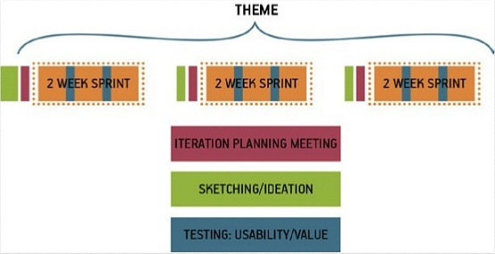

# Chapter 5. User Validation {#chapter-05} 

## Maximum 5 days until next User Validation

## Levels of Validation

* Unit tests and integration tests must be written by developer and run as part of automated frequent or continuous delivery
* Problem statement(s) validated by getting out of the building!
* Personas must be posited as proto-personas and validated and developed by... Getting out of the building
* User stories are validated via built in acceptance test (Given, When, Then)
* Hypotheses can only be run by testing users with the MVP
  * That's what the MVP is for