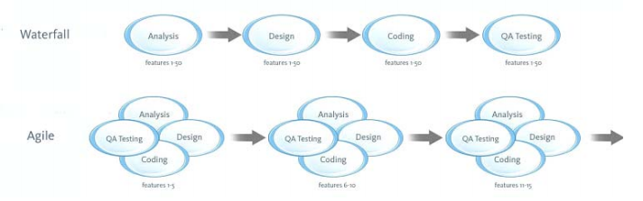
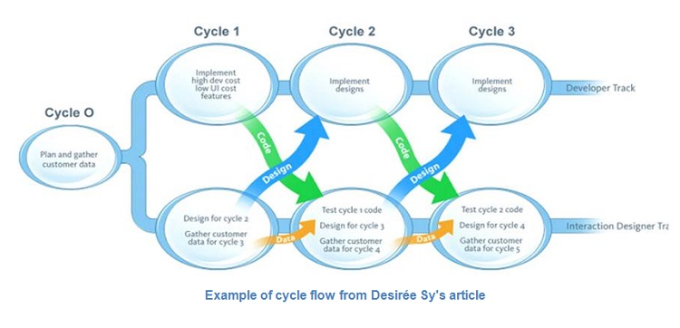

#  1. DurableDrupal Lean Process. Overview {#appendix01}

DurableDrupal Lean is a process factory, providing reusable tools and methods for a team or team of teams within an organization, with the firm purpose of defeating waterfall and guaranteeing delivered value. 

Now, that's a mighty set of phrases right there. If we understood that sentence and knew how to use it on a daily basis, we could end this right now and go have a beer. Well, let's read on. And then go have a beer. For now, let's hunker down and do what we always do when we want to learn something: deconstruct it, that is, take it apart; and then synthesize our own process by putting it back together again, both abstractly, and then as we work through this book, in actual practice.

* A process factory
  * Because we don't want to take a rigid scheme and mechanically force ourselves to go through motions that may or may not have anything to do with who we are or what we are trying to accomplish. We want to learn how to create, recreate, evolve and maintain our own process, on every team in our organization, for every different kind of project.
* DurableDrupal Lean
  * We must be in the habit of using upstream Drupal distributions in our organization. In this book we are providing one, [DurableDistro](https://github.com/DurableDrupal/durable-drupal-distro), along with an Ansible playbook to easily provision it with Vagrant. W think it will give you a great head start and it can be easily curated as needed; and we also list [a lot of the most useful ones out there](#appendix-02-distributions) which you can use for many specialized purposes right off the shelf. The question as always is to stand on the shoulders of giants.
  * Lean: Agile is the new Waterfall. We need Lean, and we want you to know what this software development process is all about and why it should be important to you.
  * See below for explanation of what is Waterfall, Agile, Lean, etc.
* Reusable tools and methods
  * We want to review them here. Later on you will make your own. We want to keep it down to a dull roar though, in order to avoid top heavy, documentation laden wastes of time.
* For a team or team of teams.
  * We are talking continuous improvement in your organization, whether it's a one man shop (still a team!), an agency or company department with a single team, or a team of teams (we never want to work on a scale bigger than a team when we focus on work in progress). We are talking everyone face to face in a single building, or a world-wide distributed team or team of teams. 
* Guaranteeing delivered value
  * Because code can no longer be implemented on the basis of "functional requirements". Code's sole purpose in living is to be able to test a hypothesis envisioning value to be obtained by the client as a result of its existence. Code should be designed as such, and tested as such. Becuase neither is it enough to test code and be satisfied that it works as advertised in order to consider a job of work completed. The functionality designed to give value must be tested to make sure it actually delivers that expected value to the client. This is at the core of Lean and we'll be sure to drill down here.

In order to gain this insight, as we work through this book we will be needing to get comfortable (not necessarily all at once! we recommend just in time reading as needed, perhaps on a chapter by chapter basis) with the following:

* [A very short history of modern software development process](#appendix01-short-history)
* [Kanban (not Scrum)](appendix01-kanban)
* [Project Inception and Vision](appendix01-inception)
* [Team Kickoff](appendix01-team-kickoff)
* [Development Workflow with Everything in Code](#appendix01-dev-workflow)
* [DevOps](#appendix01-devops)
* [Continuous Integration and Continuous Delivery](#appendix01-ci-cd)
* [User Validation](#appendix01-user-validation)
* [Bibliography and Resources](#appendix01-bibliography)

## A very short history of modern software development process {#appendix01-short-history}

Why use process at all? Well, work is social in nature, ever since we humans gained an opposable thumb. And it always exists in an historical context. So we engineer things using today's tools and processes in order to avoid making the same expensive mistakes over and over again, and in order to avoid inventing the wheel every time we tool up for a product.

We need process to avoid wasting time, money and resources. To avoid failing. Again and again.

### The limitations of Waterfall and Agile for Web development

The much criticized [Waterfall Model](http://en.wikipedia.org/wiki/Waterfall_model) is a sequential process for software development "in which progress is seen as flowing steadily downwards (like a waterfall) through the phases of Conception, Initiation, Analysis, Design, Construction, Testing, Production/Implementation and Maintenance." Each phase corresponds to an autonomous silo which receives its input from the previous silo and performs additional work according to its particular discipline. So outputs are handed off in sequence from one discipline "silo" to another. It is no accident that this method, which at least raised software development from the level of artesanal improvisation to that of engineering, had its origins in the highly structured manufacturing and construction industries.

[Agile software development methodologies](http://en.wikipedia.org/wiki/Agile_software_development), on the other hand, favor an iterative and incremental approach due to the following shortcomings evidenced by the Waterfall Model:

* A minimum of 40% in change requests take place during project life-cycle, making it impossible for each discipline to  complete its work and then hand-off a perfect output to the next discipline in line: discipline silos having already "finished" their work will have to do it all over again to comply with those changes, and the impact may vary widely. For example, the design and even the candidate architecture may have to be completely re-done.
* Clients often need to see working prototypes at various stages in order to properly finalize their requirements, so that Construction cannot be carried out in one fell swoop without a series of programmed opportunities for user feedback.
* Design may dictate solutions impossible or very difficult to implement, which can only be seen during the Construction phase. In other words, a lot of design and construction work may have to be thrown away and started over.
* By the same token, design may be dictated by stakeholders who are unaware of the full benefits of the technology, and only become aware as Construction progresses, which is one of the principle sources for the high rate of change requests in most projects.

Diserée Sy's article [Adapting Usability Investigations for Agile User-centered Design](http://uxpajournal.org/wp-content/uploads/pdf/agile-ucd.pdf), published in 2007, first introduces the characteristics of both the Waterfall and Agile software development methodologies, contrasts the benefits of Agile to the deficiencies of Waterfall, and then goes on to enumerate certain "adaptations to the timing, granularity, and reporting used for Agile interactive usability investigations, with an intended audience of usability practitioners."

In other words, Agile is an improvement over Waterfall since the abyss separating requirements gathering from testing is shorter and since the mini-cycles allow for more cross-collaboration, testing and feedback. This can be seen in the following diagram from the article:

> "However, this meant that we needed to find a way to conduct usability tests, interviews, and contextual inquiry—both in the lab and the field—within an Agile framework. To achieve this, we adjusted the timing and granularity of these investigations, and the way that we reported our usability findings. This paper describes our main adaptations." 
> 
> "It is possible to use the familiar arsenal of usability investigation methods on Agile (and other iterative development) projects, including formative usability testing, user and task analysis, interviews, and even field-based work like contextual inquiry. This is achieved by changing the timing and granularity of the investigations, and how results are reported."

In the article, Sy and Miller describe in detail the method they developed for integrating Agile with user-centered design.

### Improving Agile with Cycle 0 and Staggered Sprints

The solution resided in a technique called Cycle 0 (sometimes called Sprint 0 or Staggered Sprints), in which design activity takes place one sprint ahead of development. Work is designed and validated during the “design sprint” and then passed off into the development stream to be implemented during the development sprint. 

> "To allow the User Experience Team to iterate on designs, we usability tested prototypes at least one cycle ahead of developers, and then passed on the validated designs to be implemented. We would also conduct contextual inquiry for workflows at least two cycles ahead, and usability test the implemented working version to check for design drift."

### Achieving a still better process with Lean UX and Design + Dev

> "Many teams have misinterpreted this model. Sy and Miller always advocated strong collaboration between designers and developers during both the design and development sprints. Many teams have missed this critical point and have instead created workflows in which designers and developers still communicated by handoff, creating a kind of mini-waterfall process within the agile cycles." (From *Gothelf, Jeff (2013-02-22). Lean UX: Applying Lean Principles to Improve User Experience, O'Reilly Media)*

What occurs is that even when cross collaboration is encouraged, with staggered sprints it becomes very easy for the entire team to never be working on the same thing at the same time. You never realize the benefits of cross-functional collaboration because the different disciplines are most often focused on different things. Also, when two-week sprints are used in a Scrum context, designers do not get enough creative time.

As a result it's necessary to go beyond staggered sprints.

First of all, themes allow for several scrums to be united under the same umbrella, giving time for greater creativity on the part of graphic design and user experience team members, and "the entire team is working on the same thing at the same time".

Each theme, and indeed each sprint, is kicked off with a series of brainstorming and validation exercises with the participation of the whole team (light green). The resulting ideas and sketches are taken to the traditional sprint planning meeting, where again the whole team participates in a process of writing user stories, and then evaluating and prioritizing them to form the sprint backlog (purple).

Then, weekly user validation sessions are added in (blue-green), so that the ideas being implemented can be subject to testing for usability and value.

See also [Beyond Staggered Sprints: How TheLadders.com Integrated UX into Agile](http://johnnyholland.org/2010/10/beyond-staggered-sprints-how-theladders-com-integrated-ux-into-agile/).
  
### The Best Process we Know: Design + Dev + DevOps

DurableDrupal Lean adds DevOps into the mix. Just as it is critical for cross-collaboration between design and development, so it is just as critical for there to be cross-collaboration between design, development and DevOps, both in provisioning so that the team can really work in parallel, as well as in building, feedback conversations, testing, continuous integration and deployment.

### Waste that is eliminated by using DurableDrupal Lean

Waste is of course, the opposite of value. Possible causes of waste in software development:

* Unfinished work left rotting in isolated silos
* Feature creep without validating for impact or value
* Isolated silos keep on re-inventing the wheel
* Handoffs chronically disrupts workflow
* Delays because isolated silos and teams missing skills
* Task switching because work overload and broken workflow
* Mucho defect because chaotic focus and blocked knowledge sharing

See also [How to Manage the "7 Wastes" of Agile Software Development](https://www.scrumalliance.org/community/articles/2013/september/how-to-manage-the-7-wastes%E2%80%9D-of-agile-software-deve).

## Kanban (not Scrum) {#appendix01-kanban}

The great thing about Kanban is that it does away with the arbitrary pre-estimated "sprints" one finds when using Scrum, designed to force the delivery of a "complete" mini-release. Rather it is a continuous flow process. Core jobs of work seeking a particular outcome are implemented one at a time in cross-collaboration, and their associated cards pass through various states (represented by columns) in the process. At the start all issues are placed in the New column (state). Then these are prioritized and a number of them are placed in the limited backlog "To Do" column.

Then, when team members work on a job, it is placed in the "In Progress" or "Doing" column. This column is also limited in the number of issues it can contain. The reason for these constraints is key to why Kanban is different: it champions focus and prohibits people working on too many things at the same time. This is called a Work in Progress (WIP) limit, and it replaces the constraint of the sprint cycle length and time frame restrictions found in Scrum. In this way, Kanban frees us from waterfall-like mini-release "estimates". So while there are no sprints, only a continuous flow of jobs of work being delivered for outcome value testing, the WIP limit, seen in parenthesis in the To Do and In Progress column titles, seeks to optimize productivity without overload. The actual number is calculated by taking into account team size and velocity, and is adjusted for maximum productivity without overloading the team as the project matures. We limit the To Do column and the Doing column to 4 (number of separate disciplines being worked on with semi-paired programming).

Also see the [details given given in chapter 1 on the use of Kanban](#chapter-01-gtd).

## Project Inception and Vision {#appendix01-inception}

Project Inception and Vision means that there has to be some starting point, based on inputs provided by the product owner (a client domain expert, marketing person, major stakeholder rep, etc.). These inputs must be gathered as part of the more general preparation for the Project Team Kickoff in the form of a Vision text.

### Preparation

Such preparation may include such tasks as the following:

* Gather all inputs: Client documentation, conversations, Legacy site and business context
* Create initial Project Vision text for team starting point
  * Detected pain points: who are experiencing them and what would they consider to be a solution?
  * List architecture alternatives: Frameworks, re-usable Drupal distros and other proven solutions
  * List initially detected constraints
* What team are we going to assemble for kickoff?
* Best way to provision team development and testing?
* Initial basic prototype as starting point for kickoff?

In this way everything needed for the initial Project Kickoff is put together through cross-collaboration by the initial core team.

### Additional inputs for the Vision text

* Product Owner must contribute to first cut of Market, Problem, Product definitions
  * Notes from phone conversations with stakeholders and users
  * Review of existing solutions (e-mail list)
  * Conversations with existing workshop members
    * Writers
    * Publishers
* Initial Team Core must gather:
  * Review of solution architecture alternatives
  * Any detectable constraints

The actual text is the responsibility of the Product Owner but will be done in cross-collaboration with the initial core team.

### Vision text template

A template for the Vision text may be downloaded on the DurableDrupal site.

The Vision text helps to get the ball rolling at the Team Kickoff meeting because it puts forward a first stab at the project validation targets: Market, Problem and Product.

T> ### You don't have to use each section of the Vision text.
T>
T> The DurableDrupal Lean Vision text template simply provides convenient avenues of input, they are all optional. Don't feel forced to spend time filling out sections of this or any other doc!
T>
T> Most importantly, the Vision will represent a first processing of product inputs and provide a starting point at the Kickoff for beginning to understand and validate problem, product and market in terms of value. 

> "A market is the group of people you think might want to buy your product.... A problem is the reason that those people are going to use your product... A product is simply the way that you’re going to solve the user’s problem. It’s the end result of what you’re building. It’s the thing that people, presumably in the target market, are going to pay you money for." (from Laura Klein, *UX for Lean Startups*, Chapter 1)

#### Validating the Market

> "You’ll know that you’ve successfully validated your market when you can accurately predict that a particular type of person will have a specific problem and that the problem will be severe enough that that person is interested in purchasing a solution."

#### Validating the Problem

> "You are going to discover a problem that exists within your target market that
you are capable of solving. Remember, if there’s no problem, then there is no compelling reason for
people to purchase your product.... You’ll know that you’ve validated a problem when you start to hear
particular groups of people complaining about something specific."

#### Problem Statement (or list of pain points)

The problem statement summarizes the problem being solved by the project. The following format may be used:

The problem of 

    << describe the problem >> 
    
affects 

    << the stakeholders affected by the problem >>
    
the impact of which is

    << what is the impact of the problem? >>. 

A successful solution would 

    << list some key benefits of a successful solution >>

#### Validating the Product

>  "Just because you have discovered a real problem and have a group of people willing to pay you to solve their problem, that doesn’t necessarily mean that your product is the right solution.... You’ll know that you’ve validated your product when a large percentage of your target market offers to pay you money to solve their problem." 

#### Defining a product with a list of needs per pain point

For each pain point experienced by each person described as making up the product market, list the proposed solutions that would ease the pain

* Need
* Priority
* Concerns
* Current solution
* Proposed solutions

#### Product Position Statement

For

    << target customer >>
    
Who

    << statement of the need or opportunity >>

The {product name}

    << is a {product category} >>

That

    << statement of key benefit(s); that is the compelling reason to buy >>.

Unlike

    << primary competitive alternative >>
    
Our product

    << statement of primary differentiation { especially via pain points found in competition } >>

#### Candidate architectures

Members of the team whose skillset includes software architecture, based on their past experience
and the current vision, propose a core set of technologies, component models and deployment
targets.

#### Constraints

> “A constraint is a restriction on the degree of freedom you have in providing a solution. Constraints are effectively global requirements, such as limited development resources or a decision by senior management that restricts the way you develop a system. Constraints can be economic, political, technical, or environmental and pertain to your project resources, schedule, target environment, or to the system itself.” (From [Constraints: An Agile Introduction, on Agile Modeling](http://www.agilemodeling.com/artifacts/constraint.htm#sthash.RV6S97Od.dpuf)

### Vision text example

An example Vision text may be downloaded on the DurableDrupal site.

### Team Selection

* Anna (Product Owner)
* Jake (DevOps)
* Mark (UX)
* Jeff (Back end)
* Lisa (Front end)
* Victor (Project Coach)
* Sherrie (Graphic design)

Team selected on the basis of our Vision. Now, rather than "10x" rockstars, we have a 10x team who get to be productive thanks to cross-collaboration, communication, focus and teamwork. If the so-called 10x developer does emerge it is by dint of working as part of a great team. 10x is a social team thing or it is nothing.

The Product Owner ideally comes from the client's organization, is responsible for creating and defending the Project Vision. Most important member of the team. If no-one is available from the client's organization... then don't do the project! Perspectives for failure are high. Seriously. If you absolutely want to go ahead anyway, you must use a courageous and outspoken proxy.

### Resources for Team Provisioning

* Ansible playbook for setting up DurableDrupalDistro with Vagrant and VirtualBox locally or on server. [Video Demo](https://www.youtube.com/watch?v=ZVSGrID3g_s). 
  * On GitHub: [ansible-vagrant-durable-drupal-distro](https://github.com/DurableDrupal/ansible-vagrant-durable-drupal-distro)
  * On GitHub: [DurableDrupalDistro](https://github.com/DurableDrupal/durable-drupal-distro)
* [Create a Drupal project on Pantheon and pull it down to your laptop on Kalabox](http://awebfactory.com/node/521)
  * [Pantheon overview](https://pantheon.io/how-it-works) and [workflow overview](https://pantheon.io/docs/articles/sites/code/using-the-pantheon-workflow/)
* [Setting up a local environment for a Drupal project on Platform.sh](https://docs.platform.sh/use-platform/getting-started-for-the-impatient/#how-to-set-up-your-local-drupal-development), click here for [more details](https://docs.platform.sh/use-platform/set-up-local-development/)
  * [Platform.sh overview](https://docs.platform.sh/use-platform/getting-started-for-the-impatient/) and [development workflow video](https://platform.sh/videos/2014/07/31/development-workflow/), additionally, [Environment workflow](https://docs.platform.sh/overview/platform-environments/)
* [Best = Free: Drupal Team Project Management tool based on latest Eclipse release](http://awebfactory.com/node/510)
* [Best = Free: Drupal IDE based on latest Eclipse release (Kepler)](http://awebfactory.com/node/509)

### Prototype for Kickoff Starting Point?

In the absence of any legacy site, a simple prototype might be worthwhile for the first team meeting, at Kickoff. As a kind of discovery exercise.

## Team Kickoff {#appendix01-team-kickoff}

* Every sprint has a kickoff, not just the first
* Everyone participates
* Domain experts are invited where needed
* May last a few hours or a week, whatever it takes

### What goes on at the Kickoff

Brainstorming and validation exercises which will enable the team to define a minimum viable product (MVP) as a set of user stories constituting the current backlog.

* Problems, Assumptions, Hypotheses
* Collaborative Design and Prototype towards Initial MVP
* MVP is the minimum release of the product capable of testing the hypotheses
* Once the MVP is defined, a subsequent Iteration Planning Meeting defines user story backlog

### Problems, Assumptions, Hypotheses

* Clarify problem statements
* List assumptions gleaned from the problem statements
* Prioritize assumptions in order to create hypotheses to test those assumptions
* Personas
* Feature brainstorming
Note:
"Our goal is not to create a deliverable, it’s to change something in the world — to create an outcome. We start with assumptions instead of requirements. We create and test hypotheses. We measure to see whether we’ve achieved our desired outcomes."

The MVP will be the minimum running product capable of testing the hypotheses. Later iterations will break the hypotheses down into sub-hypotheses as the final testable MVP emerges. 

### Problem Statement Template

[Our service/ product] was designed to achieve [these goals]. We have observed that the product/ service isn’t meeting [these goals], which is causing [this adverse effect] to our business. How might we improve [service/ product] so that our customers are more successful based on [these measurable criteria]?

### Problem Statement Example

Our service offers a conduit between job seekers and employers trying to hire them. Through our service, employers can reach out to job seekers in our ecosystem with employment opportunities. We have observed that one critical factor affecting customer satisfaction is how frequently job seekers respond to employer messages. Currently, job seekers are replying to these communications at a very low rate. How might we improve the efficacy of our communication products, thus making employers more successful in their jobs and job seekers more satisfied with our service?

### Hypothesis template

We believe [this statement is true]. We will know we’re [right/ wrong] when we see the following feedback from the market: [qualitative feedback] and/ or [quantitative feedback] and/ or [key performance indicator change].

### Hypothesis example

We believe that creating an efficient communication system within TheLadders’ product experience for recruiters and employers will achieve a higher rate of contact success and an increase in product satisfaction. We will know this is true when we see an increase in the number of replies from job seekers to recruiter contacts and an increase in the number of messages initiated by recruiters in our system.

### Sub-hypothesis template

We believe that [doing this/ building this feature/ creating this experience] for [these people/ personas] will achieve [this outcome]. We will know this is true when we see [this market feedback, quantitative measure, or qualitative insight].

The prioritized list of sub-hypotheses consitutes one of the most important results of the kickoff.

### Personas

 * Atavar or sketch, name, age, city, occupation, etc.
 * Behavorial demographic information
   * Marital status, Number of children, their ages, Working conditions, Leisure time, lifestyle, etc.
 * Pain points and needs
 * Potential solutions
 
Create Proto-personas, research this in the field to validate and develop. To do this research we need to "get out of the building" ([Steve Blank](http://steveblank.com/2010/03/11/teaching-entrepreneurship-%E2%80%93-by-getting-out-of-the-building/)) to test the problem statement and associated assumptions. Why take advice from an entreupeneur coach?

**Because every project is a start-up**!

### Feature brainstorming

Once we have personas with real problems that have been (ideally) researched and validated, we can brainstorm on features that will drive customer behavior towards the desired outcomes. We brainstorm and  create a list (stick them all up on the wall and then prioritize them).

**Features will be the basis for themes** (focused sets of sprints or work in progress on the basis of plenty of time for designer creativity and cross-collaboration).

### Collaborative Design and Prototype towards Initial MVP

#### Why and what

* Everybody gets to design together
* Low fidelity sketches and artifacts increase collaboration
* Methods such as group design studio build a shared understanding of features across the team

#### Methods and techniques

* Collective design studio
* Style guides and pattern libraries
* Special techniques for remote distributed teams

### Iteration Planning Meeting

The classic meeting using everything we've gathered together so far to write user stories (together) and specify the iteration backlog.

### User story template

Influenced by [A framework for modern User Stories by @jonatisokon](https://medium.com/@jonatisokon/a-framework-for-user-stories-bc3dc323eca9).

**Classic format**

As a [persona, user] I want to [perform action] so that [achievable goal].

**User validation test addendum**

Given that I'm [performing action] ... 
When [point of observation]
Then [observable result]

### User story example

As a writer I want to save my story so that it can be critiqued.

Given that I have saved my story
When I tap the save icon to save my story
Then saved to my stories and visible to fellow workshop members

## Development Workflow and Everything in (Versioned) Code {#appendix01-dev-workflow}

By the time the user stories are written for the current backlog, the whole team has been "kicked off" on each of them. A short excerpt from Gothelf shows what collective development is like as the team works to complete the backlog:

> It’s Tuesday and Rick, Mark, Olga, and Arti are standing at the whiteboard , looking at a wireframe that they’ve drawn. Arti has a marker in her hand, but she’s not drawing. “Rick, I don’t understand what you’re driving at. Can you explain the problem?” Rick takes the marker, wipes clear a section of the board, and explains the regulation again. The team is designing an app for stock traders, and the app has to obey a strict set of regulations. Rick, the business analyst, is responsible for making sure that the team’s designs support the rules. After a while, the team is nodding, and Arti takes the marker again. She suggests a change to the wireframe design of the app on the board and the team nods again. They all take out their iPhones, take photos of the board, and agree to reconvene the next day. They’re confident that what they’ve agreed on will be ready for user testing on Thursday. Arti, the designer, goes back to her desk to start detailing the design they’ve sketched. Mark, the front-end developer, starts building the page — he uses premade components from the living style guide the team has put in place, so he doesn’t need to wait for Arti before getting the basic pieces in place. Rick opens the project’s wiki and begins to document the decisions the team has made about the application behavior. He’ll review these choices with the product owner later in the day. And Olga, the QA tester, begins the process of writing tests for the new section of the app. (*Gothelf, Jeff (2013-02-22). Lean UX: Applying Lean Principles to Improve User Experience*)

"This is the day-to-day rhythm of Lean UX: a team working collaboratively, iteratively, and in parallel, with few handoffs, minimal deliverables, and a focus on working software and market feedback."

With the process flowing smoothly, there's nothing to stop us in our Development Workflow. Let's drill down to how this actually works. 

Every team member will need at least:

* Their own working environment as close to target production characteristics as possible
* Gitflow (distributed version control branching model) for all!
* Continuous integration (automated and managed commits, testing and deploy to the integration dev server instance)
* Special workflow for framework idiosyncracies: for example, an "everything in code" strategy for Drupal Development, a SASS environment for Drupal and/or full-stack theming.

Let's examine three possible solutions, at least:

* Rolling our own (the idea was to keep it simple...)
* Kalabox 2 dev environment and tools with, say, Pantheon
* Platform.sh cloud plus local continuous integration environment

### Everything in code with features demo

Example workflow:

~~The demo starts at minute 14:35 of the demo video (no good in Spanish!)~~

* We change the default theme and change the Site Name
* We create a feature
* We specify elements to include
* We create the feature and save it to the file system
* We enable the feature, moving the configuration of the selected elements to code
* We change the theme and the site name
* We see the feature is overriden (database is overriding code because of the changes)
* We "revert" the feature (force the database to adapt to the code)

## DevOps {#appendix01-devops}

### Resources for Server Provisioning and Deployment

In this short presentation we really wanted to emphasize the practical use of Lean, Lean UX and Lean DevOps. But here is a short list of the many available resources for the all important question of server provisioning and deployment automation for frequent and continuous build approaches. Without this, team paralysis, delays and workflow blowup will haunt us as the handoff monster rears its ugly default waterfall head.

### Resources for Server Provisioning and Deployment
* [Jeff Geerling's book Ansible for DevOps: Server Configuration Management for humans](https://leanpub.com/ansible-for-devops)
  * [GitHub Repo for the book (very actively kept up-to-date)](https://github.com/geerlingguy/ansible-for-devops)
  * [Jeff's Austin DrupalCon presentation DevOps for Humans - Ansible for Drupal Deployment Victory!](https://austin2014.drupal.org/session/devops-humans-ansible-drupal-deployment-victory.html)
    * [Slides](http://www.slideshare.net/geerlingguy/devops-for-humans-ansible-for-drupal-deployment-victory)
  
* DigitalOcean tutorial [How To Create an Ansible Playbook To Automate Drupal Installation on Ubuntu 14.04](https://www.digitalocean.com/community/tutorials/how-to-create-an-ansible-playbook-to-automate-drupal-installation-on-ubuntu-14-04)

## Continuous Integration and Continuous Delivery {#appendix01-ci-cd}

For true team cross-collaboration to exist we'd better have enough feedback on changes to the codebase and on deployment to environments. And that includes automated feedback. In a nutshell we are actually talking about ALM: Application Lifecycle Management.

These may be evolving terms, but if we're using them (and we are) we'd better get them straight. Bryan Root makes [a good distinction](http://blog.nwcadence.com/continuousintegration-continuousdelivery/):

> "So what is CI?  In short, it is an integration of code into a known or working code base.... The top benefits are to provide fast feed back to the members of the team and to ensure any new changes don’t break the working branch."
>
> "CD... is an automated process to deliver a software package to a environment.... we can now extend the fast feedback loops and reduction of constraints with packaging techniques, automation workflows, and integrated tools that keep track of the software versions in different environments."
>
> " CI and CD are two completely separated practices that are tightly interlocked to create a unified ALM workflow."

So, it's not just tools, the question is for the following feedback to be available: on the one hand, build and automated test results, and on the other, application status upon deployments of new features to environments (i.e., development/integration, staging, live). 

## User Validation {#appendix01-user-validation}

### Maximum 5 days until next User Validation

### Levels of Validation

* Unit tests and integration tests must be written by developer and run as part of automated frequent or continuous delivery
* Problem statement(s) validated by getting out of the building!
* Personas must be posited as proto-personas and validated and developed by... Getting out of the building
* User stories are validated via built in acceptance test (Given, When, Then)
* Hypotheses can only be run by testing users with the MVP
  * That's what the MVP is for

## Bibliography {#appendix01-bibliography}

### Agile/Lean

* [The Agile Manifesto](http://agilemanifesto.org)
* [Extreme Programming: A gentle introduction](http://www.extremeprogramming.org/)
* [Agile Software Development: A gentle introduction](http://www.agile-process.org/)
* [The Lean Startup by Eric Ries](http://theleanstartup.com/book)
* [Mike Cohn's Scrum and Agile site](http://www.mountaingoatsoftware.com/)
* [Agile @ Adobe Agile Resources](http://blogs.adobe.com/agile/2014/12/05/agile-resources/). Excellent comprehensive list of all kinds of Agile and Scrum Resources
* [Extreme Programming Explained: Embrace Change by Ken Beck](http://www.amazon.com/Extreme-Programming-Explained-Embrace-Change/dp/0321278658/ref=sr_1_1)
* [Agile Software Development with Scrum by Ken Schwaber & Mike Beedle](http://www.amazon.com/dp/0130676349). Original Scrum book.
* [User Stories Applied by Mike Cohn](http://www.amazon.com/User-Stories-Applied-Software-Development/dp/0321205685)
* [How to Manage the "7 Wastes" of Agile Software Development](https://www.scrumalliance.org/community/articles/2013/september/how-to-manage-the-7-wastes%E2%80%9D-of-agile-software-deve)

### Lean UX

* [Lean UX - Applying Lean principles to Improve User Experience by Jeff Gothelf and Josh Seiden](http://www.jeffgothelf.com/blog/lean-ux-book/#sthash.22gOyp12.dpbs)
* [UX for Lean Startups: Faster, Smarter User Experience Research and Design by Laura Klein](http://www.amazon.com/UX-Lean-Startups-Experience-Research/dp/1449334911)

### Kanban

* [Mattias Skarin's Kanban resource page](https://www.crisp.se/gratis-material-och-guider/kanban)
  * [10 kanban boards and their context (Examples](http://blog.crisp.se/2010/12/03/mattiasskarin/1291361993216)
    * [Downloadable PDF](http://blog.crisp.se/wp-content/uploads/2010/12/10-different-kanban-boards-and-their-context.pdf)
* [Leankit's What is Kanban article](http://leankit.com/kanban/what-is-kanban/)
  * [Leankit's Manage Projects with Kanban](http://leankit.com/kanban/online-kanban-board/)
  * [Leankit's 10 kanban boards examples implementation](http://leankit.com/blog/2010/12/10-kanban-boards-leankit-kanban-style/)
  * [LeanKanban University - Definition of Kanban Method](http://www.leankanban.com/node/10)
* [Kanban and Scrum by Henrik Kniberg and Mattias Skarin](http://www.infoq.com/minibooks/kanban-scrum-minibook)

### Content Strategy

#### Content Audits and Inventories

* [Misty Weaver and The Art of Content Audits
Audits, inventories, and the fabulous world of content planning](https://www.lullabot.com/blog/podcasts/insert-content-here/22-misty-weaver-and-art-content-audits)
  * [Misty Weaver, on the web](http://www.meaningandmeasure.com/)
* [Doing Content Inventories by Jeffrey Veen](http://www.adaptivepath.com/ideas/doing-content-inventory/)
* [Drupal Content Audit Module](https://www.drupal.org/project/content_audit)
* [http://growingventuresolutions.com/blog/content-inventory-and-content-audit-views.html

Content Strategy for the Web, by Kristina Halvorson, particularly Chapters 4 and 12

[A Checklist for Content Work by Erin Kissane](http://alistapart.com/article/a-checklist-for-content-work)

The Elements of Content Strategy by Erin Kissane

Information Architecture for the World Wide Web by Peter Morville and Louis Rosenfeld

A Project Guide to UX Design by Russ Unger and Carolyn Chandler

#### Structured Content

Karen McGrane
      http://wimleers.com/article/drupal-8-structured-content-authoring-experience 
Drupalcon Portland 2013 Keynote “Thriving in a world of change”
     http://karenmcgrane.com/2013/05/23/drupalcon-keynote-video-and-talk-notes/
A separate mobile website: no forking way!
     http://www.netmagazine.com/opinions/separate-mobile-website-no-forking-way
Jeff Eaton
Drupalcon Portland 2013 “building for the post-mobile world”
video: https://portland2013.drupal.org/node/1353
slides: https://speakerdeck.com/eaton/building-for-the-post-mobile-world
Larry Garfield
Drupalcon Portland 2013 “Is Drupal a CMS? Do we even know what that means?”
video: https://portland2013.drupal.org/node/3908
slides: http://www.garfieldtech.com/presentations/dcportland2013-is-drupal-cms/#/
Wim Leers
Drupal 8: best authoring experience for structured content?
     http://wimleers.com/article/drupal-8-structured-content-authoring-experience

A Smallcore Manifesto 
Adrian Rossouw
Where do we go from here?
Drupal is not a CMS 
Larry Garfield
COPE: Create Once, Publish Everywhere 
Daniel Jacobson
Content Strategy for Mobile 
Karen McGrane
Adaptive Content Management 
Mark Boulton
Inline Editing and the cost of leaky abstractions 
Jeff Eaton
Content Geography
The Art and Practice of Content Assembly 
Deane Barker

### Core Model

* [Original 2007 presentation by Are Halland: Core+Paths: A Design Framework for Findability, Prioritization and Value](http://www.slideshare.net/aregh/corepaths-a-design-framework-for-findability-prioritization-and-value) (Also see additional recommended slides on Slideshare)
* [The Core Model: Designing Inside Out for Better Results by Ida Aalen](http://alistapart.com/article/the-core-model-designing-inside-out-for-better-results)
  * [The Core Model: Links and Resources](http://alistapart.com/blog/post/the-core-model-links-and-resources)
 